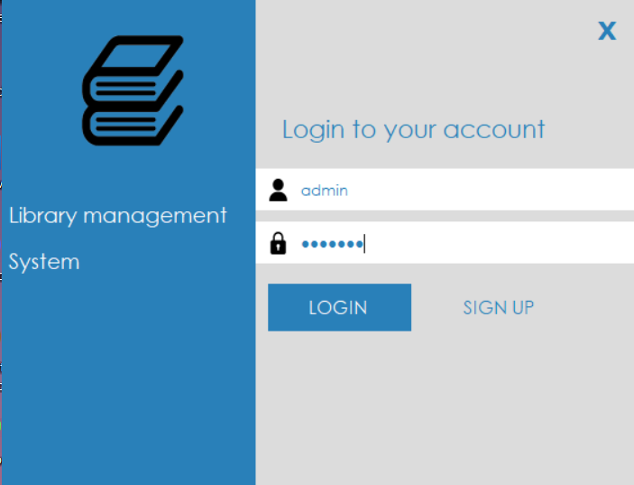
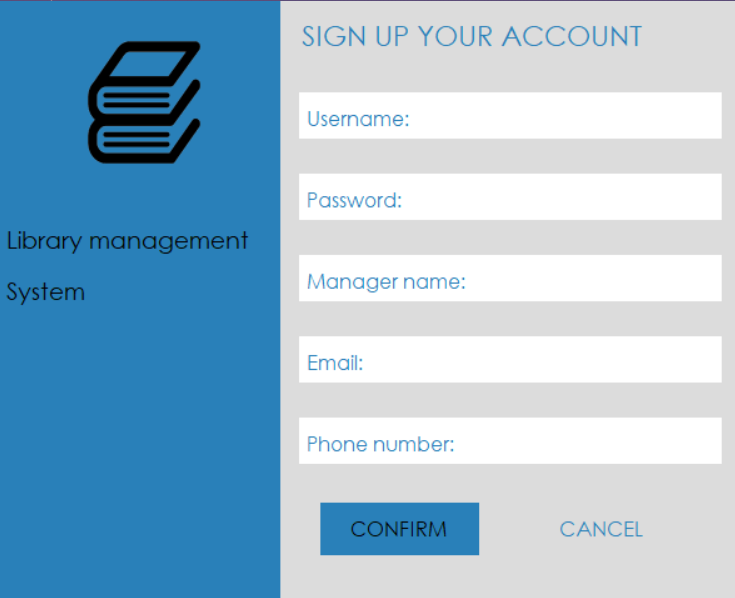

## About the project

Library Management system is used to manage a library's database with data such as book's details, student's information or loan history of a book.

The app is built on Microsoft Windows Form .NET Framework with the main programming language is C#.

## Showcase

### Authentication

    
Images (click to expand!)

    
    

